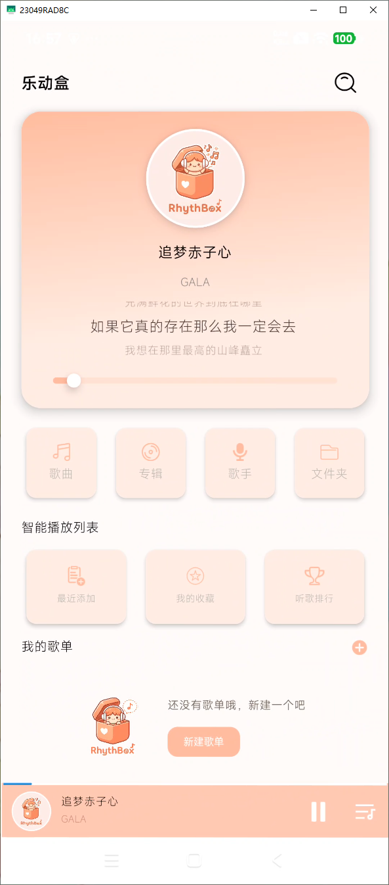
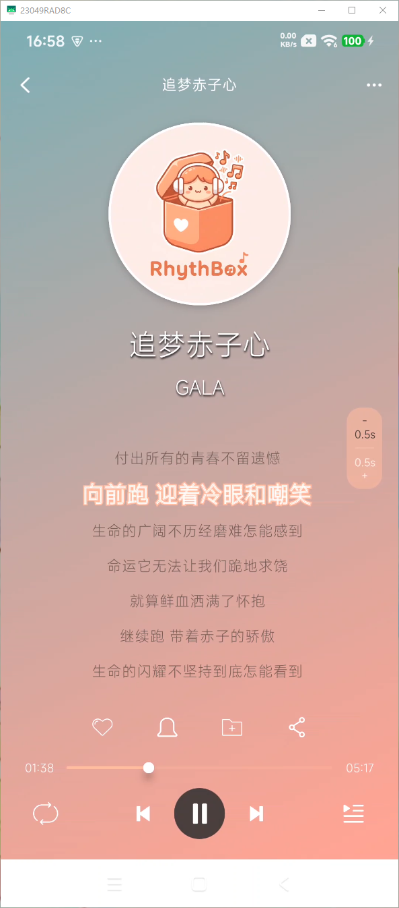

# 🎵 乐动盒 (RhythBox)

> 乐动盒（RhythBox）纯本地音乐播放器。

## 📸 界面预览 (Screenshots)

| 🍑 微醺蜜桃 · 温暖主页 | 🎤 沉浸式歌词播放页 |
| :---: | :---: |
|  |  |

---

## 📂 核心功能一览

* 🔍 **智能本地扫描**：一键唤醒隐藏在您手机各个角落的音频文件（支持 MP3, FLAC, WAV 等主流格式）。
* 🗂️ **多维歌曲分类**：支持按歌曲、专辑、歌手、文件夹快速筛选检索，找歌从此不迷路。
* 🌟 **智能播放列表**：内置“最近添加”、“我的收藏”、“听歌排行”等智能化看板，比你更懂你的音乐偏好。
* ➕ **自定义歌单**：支持自由新建本地歌单，随心定制你的专属音乐世界。

---

## 📜 绿色合规与免责声明

乐动盒（RhythBox）严格遵守各大应用商店合规条例，保障用户权益：
* **存储权限**：本应用申请的“读取本地存储权限”**仅用于**在本地扫描、读取和播放您的音频文件，绝不用于其他任何无关用途。
* **数据安全边界**：由于本软件为纯本地工具，无任何云端备份，您所有的歌单、收藏及听歌数据均保存在您的当前设备中。因系统故障、误刷机、或手动卸载应用导致的数据丢失，本应用无法为您在云端找回，请定期做好重要数据备份。

---
💡 **由 Zhiyun 独立荣誉出品。让我们一起，在音符里寻找治愈的力量！** 🍑🍃✨
